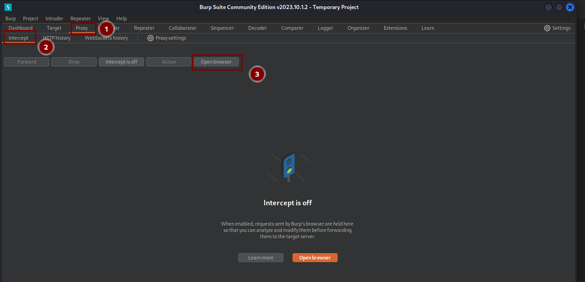
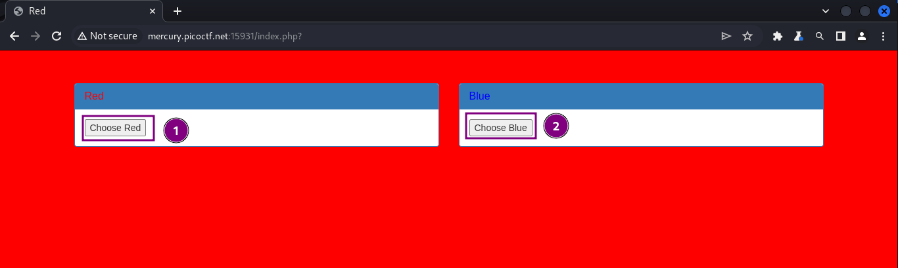
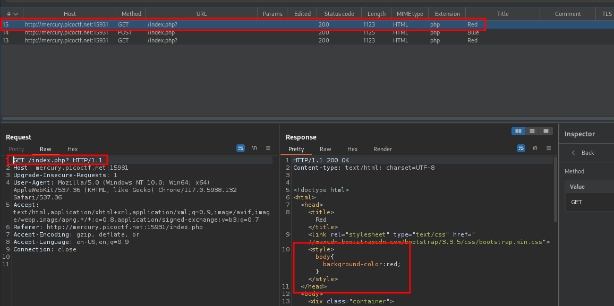
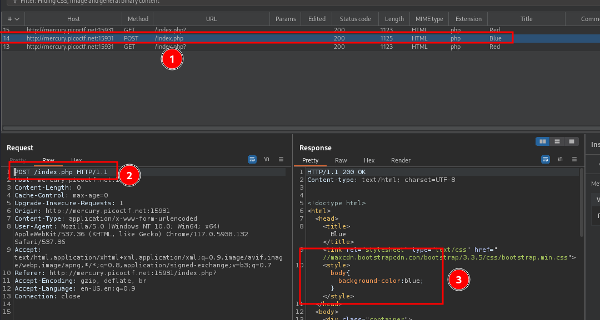
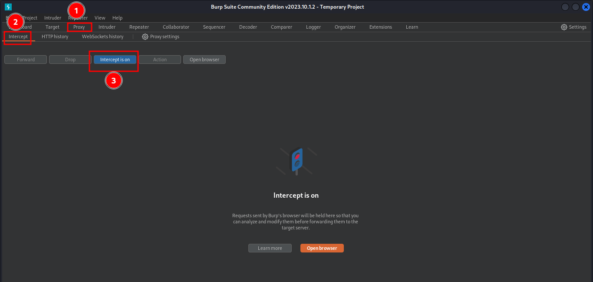
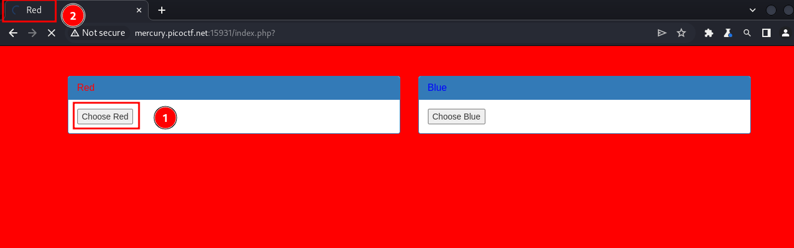
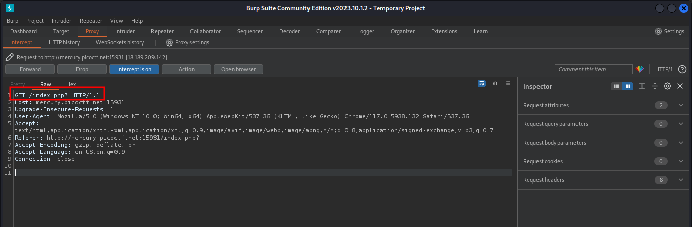
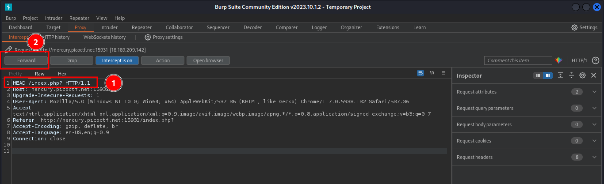
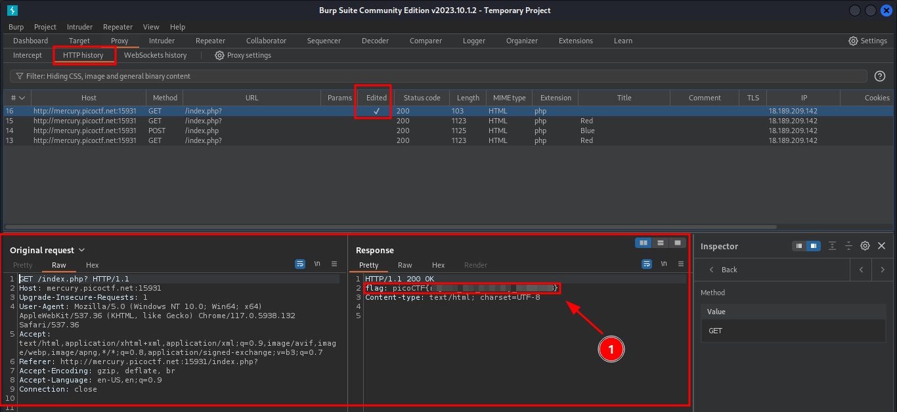

---
tags:
  - web-exploitation
points: 20 points
---
# GET aHEAD

## Write-up
##### Concept Coverage :
This Challenge covers the introduction to [HTTP methods](https://www.w3schools.com/tags/ref_httpmethods.asp) and basics of web exploitation using proxy interceptor. I am using [Burp Suite](https://en.wikipedia.org/wiki/Burp_Suite) on this one but you can other web request interceptor
##### Following are the steps for the challenge: 
1. we are provided with the URL for the website we are planning to exploit for the flag
   
2. I am using browser provided within Burp Suite
    
    
    
3. I opened the URL with the browser opened and I see following website
    
    

4. upon Clicking on the buttons on website and then going back to burp and taking a look at request made we notice that for Red we are making a GET request (1st image) and for Blue we are doing POST request (2nd Image)
    
     
    
    
5. Now looking different HTTP methods we notice that there is a GET and a HEAD method. In the challenge the name is a hint for us to try to intercept a GET request and update it to HEAD method. so first lets turn the intercept on in burp
	 
	 
	 
6. Once you turn on the intercept, go back to burp web browser and click on "Choose Red" button since we now know that red is for the GET request. You will notice that instead of getting web page the browser is stuck in a spinning state. that is because we are intercepting the request that going out in burp suite. 
    
    

7. So, if you go back to Burp you will see the request similar to the image below in the interceptor 
    
    
    
8. In the request lets update the request to HEAD and click on Forward to send the request to the server. 
    
    
    
9. To look at the response, head to the HTTP history tab and open the last sent request . Here we notice that we have the flag in the response header
    
    