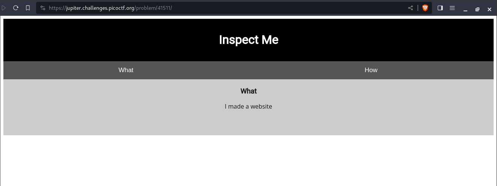
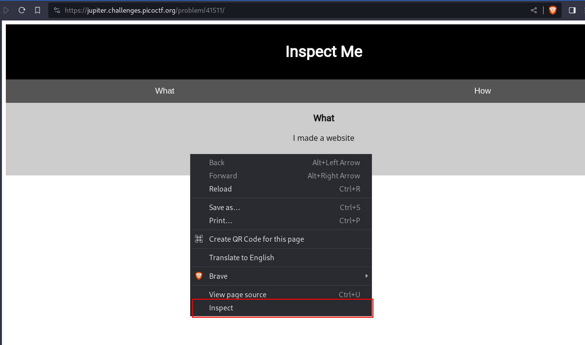
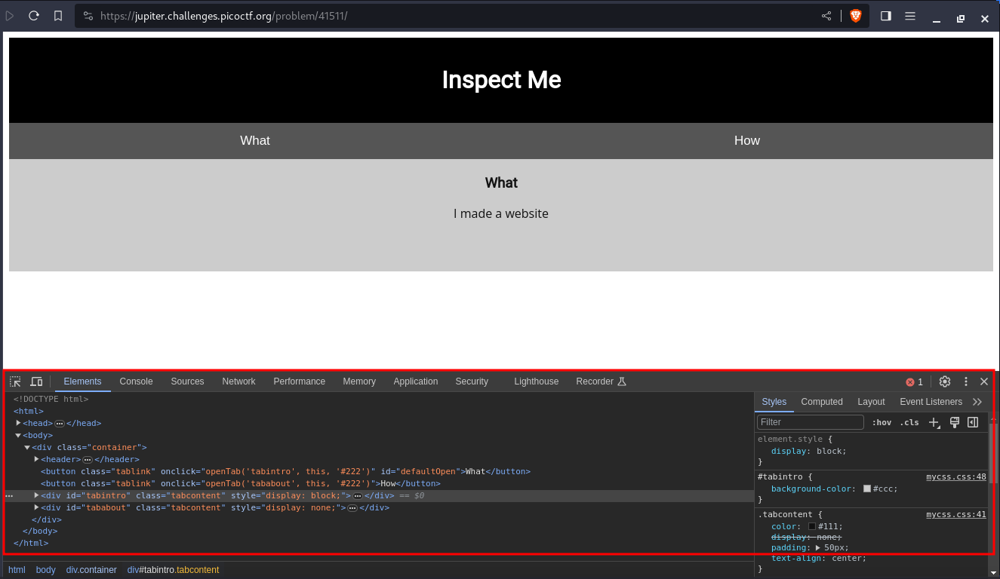
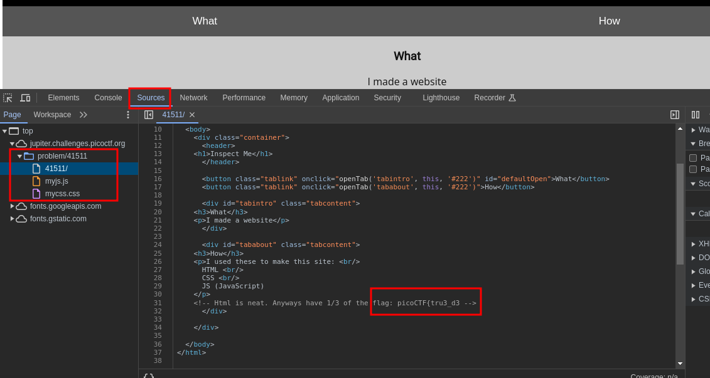
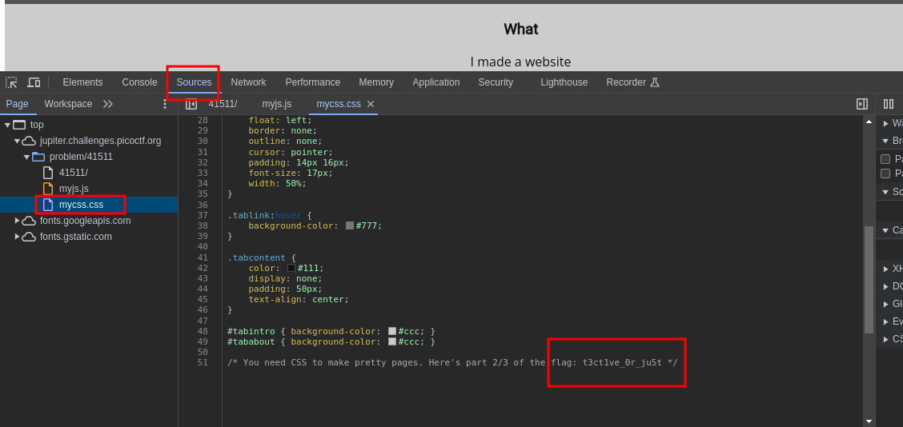
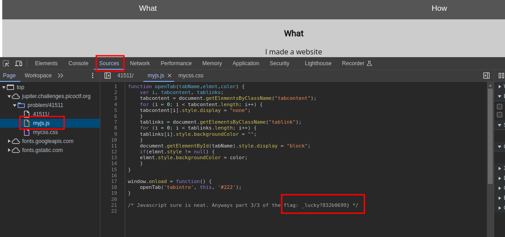

---
tags:
  - web-exploitation
points: 50 points
---

[<-- Web Exploitation Write-ups](../writeup-list.md)

# Insp3ct0r

## Write-up
##### Concept Coverage :
This challenge is an introduction to website inspector tool available with the various browser

##### Following are the steps for the challenge: 
1. We are given a link to a web page for the challenge. In my case it was `https://jupiter.challenges.picoctf.org/problem/41511/` .
   
2. Upon opening the website we are greeted with following web-page : 
    
    
    
3. We can right-click anywhere on the webpage and then select inspect from the context menu. That will open an webpage inspector
    
    
    
    
    
4. Upon reading through the html of the page I found the first part of the flag commented out in the HTML source code
    
    
    
5. Now lets take look at other files. we notice there is a JavaScript file and a CSS file. lets take a look at CSS file. Similar to first flag we find the second part flag as a comment in the CSS file
    
    
    
6. Now lets take a look JavaScript file and similar to first and second flag ,we find third part of flag is present as a comment in the JavaScript file
    
    
    
7. We just need to combine all three parts of the flag and submit it to complete the challenge
