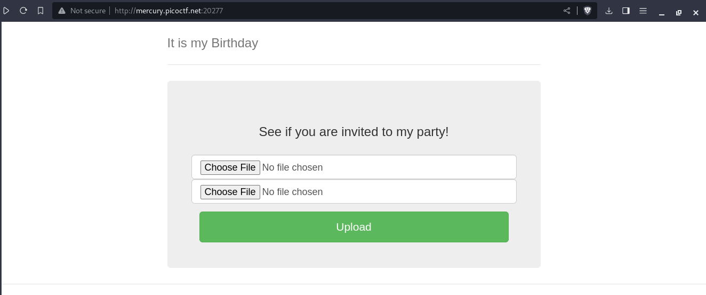
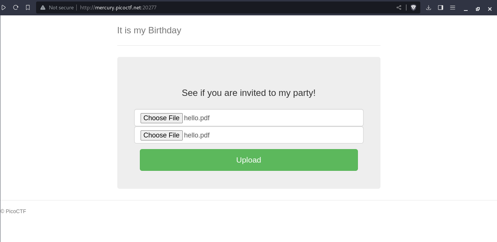
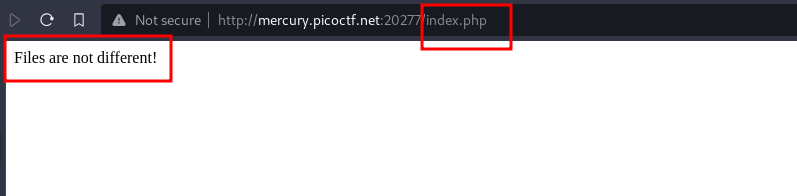
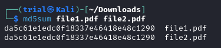
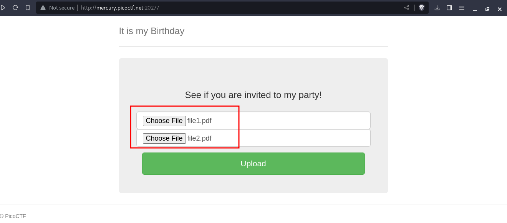
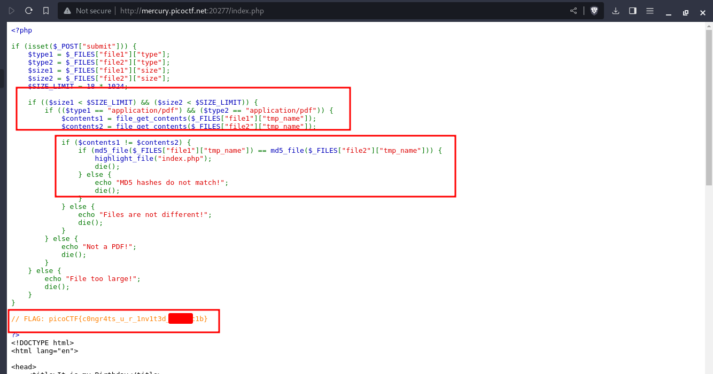

---
tags:
  - web-exploitation
points: 100 points
---

[<-- Web Exploitation Write-ups](../writeup-list.md)

# It is my Birthday
## Write-up

##### Concept Coverage :
This challenge is introduction the concept of the [MD5 colloision](https://en.wikipedia.org/wiki/MD5#)

##### Following are the steps for the challenge: 
1. We are given web URL as a part of the challenge. At the time of writing the URL was `http://mercury.picoctf.net:20277/` and it looks like following. 

    

2. Upon reading the description it asks us to submit the 2 PDF with same MD5 hash in order to obtain the `flag`. I tried to upload a same PDF file for both the parameter but it gave me the files are same. Also it returned a `index.php` so they seems to be doing content validation in `PHP` 

    

    

3. Upon searching more details on MD5 Collosion I found the following published [paper by Peter Selinger](https://www.mscs.dal.ca/~selinger/md5collision/) on MD5 collosion. I has 2 binary files present on the page. I downloaded them and renamed them to `file1.pdf` and `file2.pdf` respectively. Upon running a quick MD5 hash both files have same MD5 hash. You can also download the files here : [file1.pdf](./assets/file1.pdf) [file2.pdf](./assets/file2.pdf). 

    `Note : Those are binaries renamed as PDF so might not be able to view its content so If you are using those file please just download use it directly or you can generate your own`

    

4. Upon uploading the `PDF` files we successfully go through and the `index.php` shows us the full validation code and also the flag as a comment. We can submit that flag and complete the challenge.

    

    

