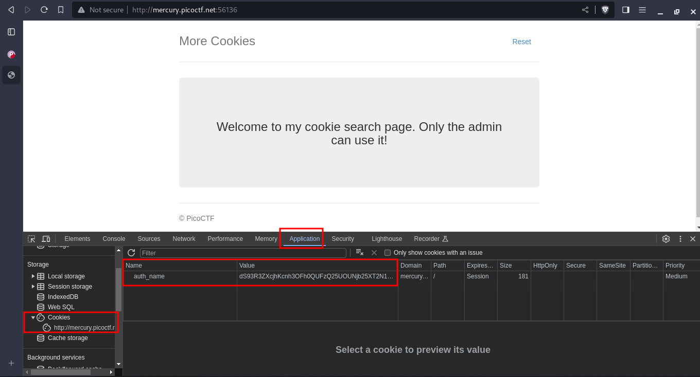
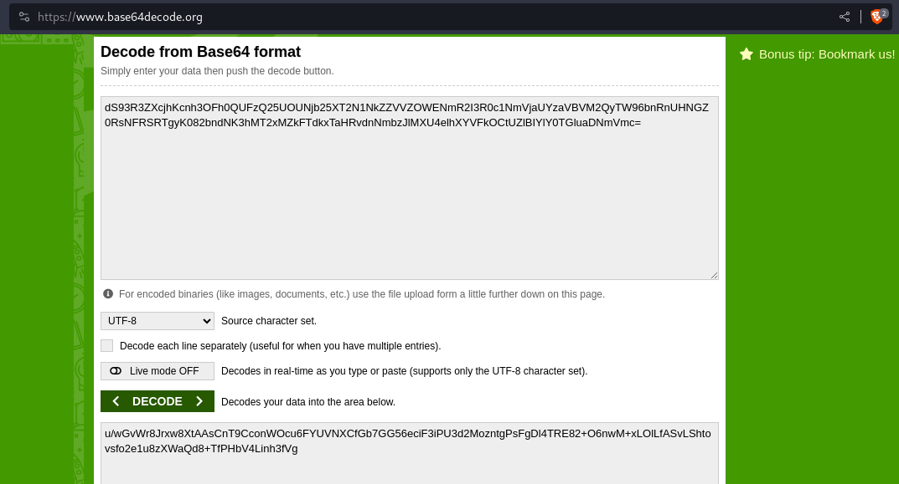
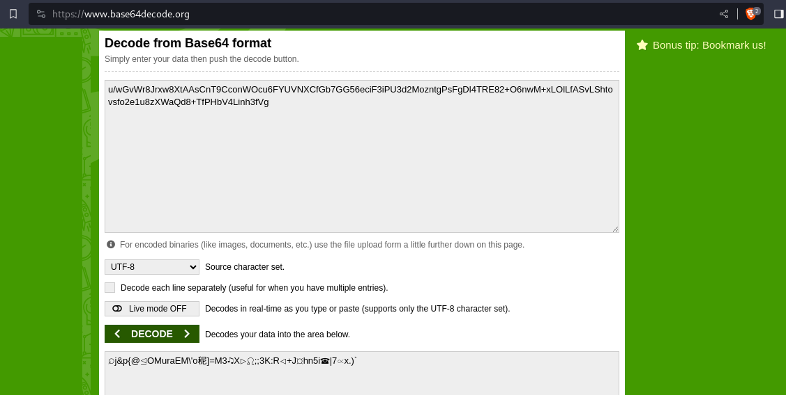
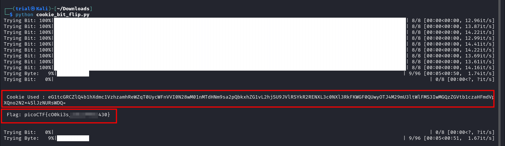
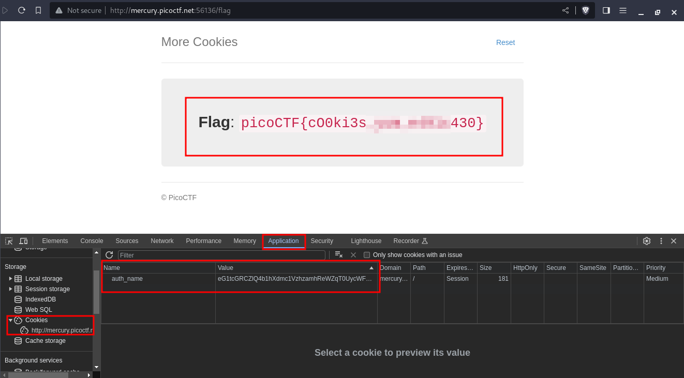

---
tags:
  - web-exploitation
points: 90 points
---

[<-- Web Exploitation Write-ups](../writeup-list.md)

# More Cookies
## Write-up

##### Concept Coverage :
This challenge is introduction to bit-flip attack on the CBC-AES ciphers.

##### Following are the steps for the challenge: 
1. we are given a URL to connect with the challenge. In my case The URL was `http://mercury.picoctf.net:56136/`. 

2. Upon visiting the URL I found the page shown below. Since the name of the challenge is `More Cookie` I started by taking a look at the cookie and I found the cookie that seems like a `base64` encoded: 

    

3. Upon doing `base64` decoding I got another cookie that looks like its `base64` encoded so I decoded again but I just got text that seems jibberish which makes sense as challenge describes that cookie is encrypted.

    - First decode

      

    - second decode

      

4. I got stuck at that point and I looked at the hint provided with the challenge. It was discussing about [Homomorphic Encryption](https://en.wikipedia.org/wiki/Homomorphic_encryption) . That reminded of the `AES-CBC` (I also noticed that `C`,`B` and `C` were captilaized in the challenge description). Upon looking for attacks that can be done against AES CBC (Just google searched `AES CBC attacks`) and found an attack called [Bit Flip Attack](https://alicegg.tech/2019/06/23/aes-cbc). 

5. Upon reading through the attack I decided to write a python code which would go through bytes of the data flipping each bit in a given byte and sending a request to see if any return the value. The python script can be found here : [cookie_bit_flip.py](./assets/cookie_bit_flip.py). After I wrote my script I was looking around to how other people did it and I found out about `tqdm` to track the progress so the script is updated to use that.

    

6. You can also take the cookie value you get as output and update in browser to get the flag in browser 

    