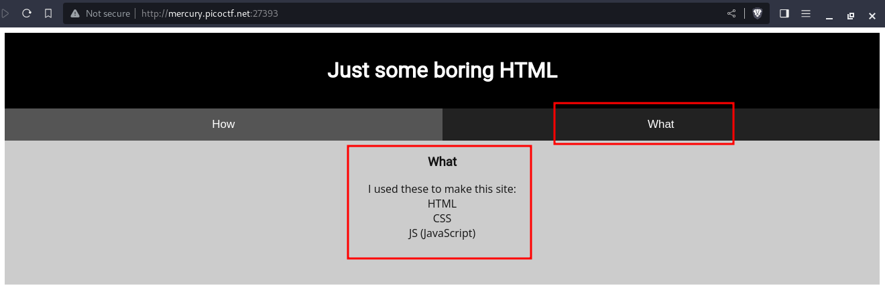
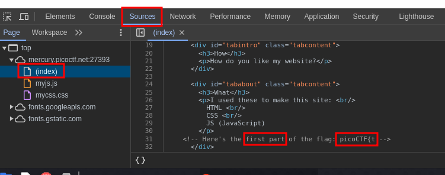
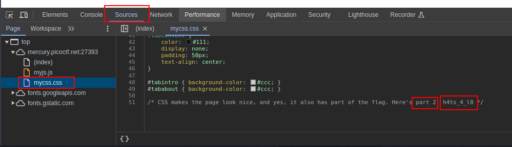
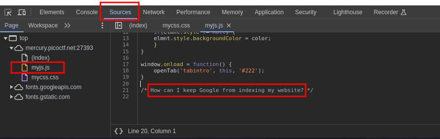
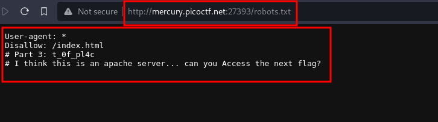
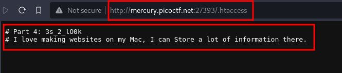
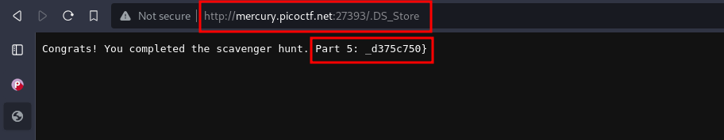

---
tags:
  - web-exploitation
points: 50 points
---

[<-- Web Exploitation Write-ups](../writeup-list.md)

# Scavenger Hunt
## Write-up

##### Concept Coverage :
This challenge covers web inspector and also covers the idea of general knowledge of technology used in industry.

##### Following are the steps for the challenge: 
1. We are given a web application URL. In my case it was `http://mercury.picoctf.net:27393/` but this might change.
   
2. Upon visiting the website we notice in the `What` tab of website that it is developed using `HTML, CSS and JavaScript(JS)`. So lets start by taking a look at the source and lets take a look at those aspects. 
    
    
   
3. Upon inspecting the page and going to source , I started inspecting `HTML (index)` page and I found the first part of the flag.
    
    
    
4. Now lets take a look at CSS file. Upon reading through the file I found the second part of the flag : 
    
    
    
5. Next up is JavaScript file. Upon reading through the file instead of a flag we found a hint on where another part of flag might be. 
    
    
    
6. Using the hint `How can I keep Google from indexing my website?` from above first thing that came to my mind is a `robots.txt` . `robots.txt` file which usually used to inform search engine crawlers which URLs the crawler can access on your site ([Learn more](https://developers.google.com/search/docs/crawling-indexing/robots/intro)). So upon navigating to `/robots.txt` URL I found the third part of flag. We are also given hint on where next part of flag might be
    
    
    
7. When I read the hint first thing I decided to look at was `.htaccess` file because that's a common file configured on Apache server.  `.htaccess` is used to make configuration changes on a per-directory basis ([Learn more](https://httpd.apache.org/docs/2.4/howto/htaccess.html)) . In order to get there we just need to replace `robots.txt` to `.htaccess` in URL.  I found the fourth part of the flag and also hint to the next part of the flag. 
    
    
    
8. The hint `I love making websites on my Mac, I can Store a lot of information there.` refers to `.DS_Store` that get created on MacOS. `.DS_Store` is a file that stores custom attributes of its containing folder, such as folder view options, icon positions, and other visual information ([Learn more](https://en.wikipedia.org/wiki/.DS_Store)). To navigate to it we just need to update `.htaccess` to `.DS_Store` in the URL. Once we do that we get the fifth part of the flag and also the final one 
    
    
    
9. Now we just need to combine all the 5 parts of the flag and submit to solve the challenge.