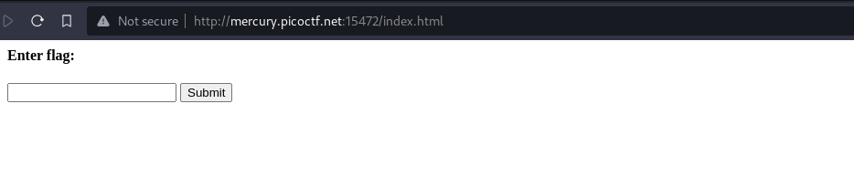
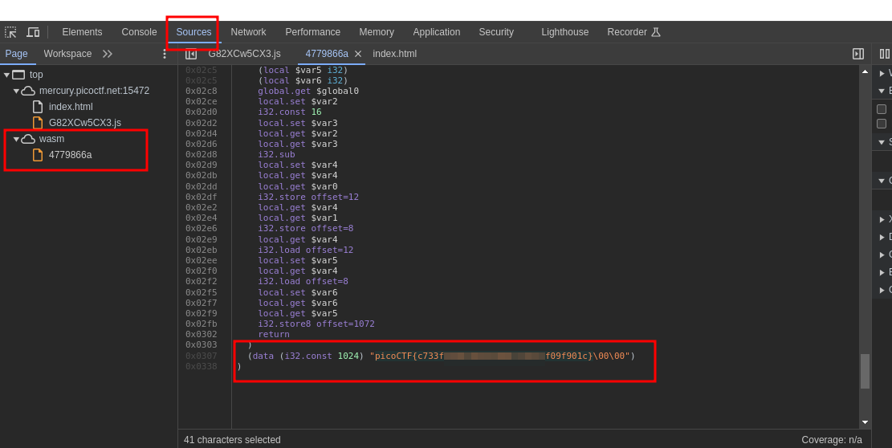

---
tags:
  - web-exploitation
points: 70 points
---

[<-- Web Exploitation Write-ups](../writeup-list.md)

# Some Assembly Required 1
## Write-up

##### Concept Coverage :
This challenge is introduction to the [Web Assembly](https://webassembly.org/).

##### Following are the steps for the challenge: 
1. We are given a website as part of challenge . In my case it was `http://mercury.picoctf.net:15472/index.html` at the time of writing but mmight change in the future.

2. Once we get to the website are greeted with the following UI.

    

3. Upon entering a random string `abc` and pressing `submit` button I got a message saying `Incorrect!` 

    

4. Since it seems be doing the validation of the input. Lets check the source if we could find correct input that might trigger something else other than `Incorrect!` message.

5. Upon taking a look we find a JavaScript file referenced in the HTML. I then took a look at the JavaScript file and it was obfuscated but I found an interseting line which had `await WebAssembly`.

    

    

6. As soon as I a call to  `Web Assembly`, I also noticed the `wasm` folder in the source which had a `Web Assembly` file. Upon reviewing the file I found the flag in the plain. I am assuming the correct way to solve this would be undertand the `Web Assembly` and figure out the correct input but since flag was present I submitted it to complete the challenge

    
