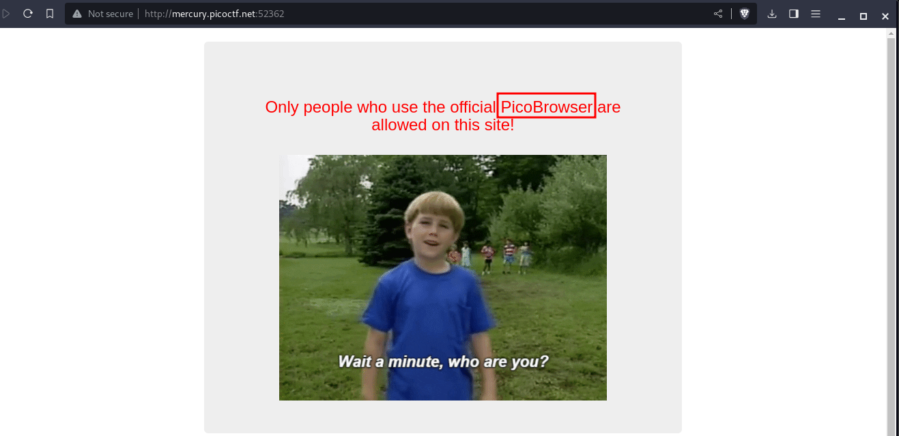
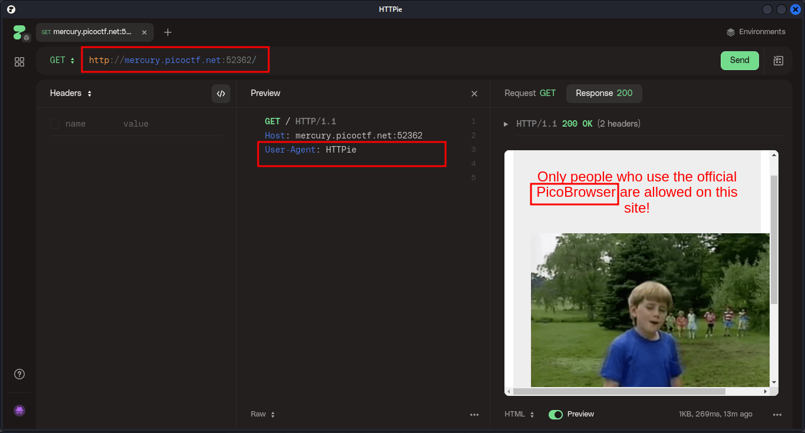
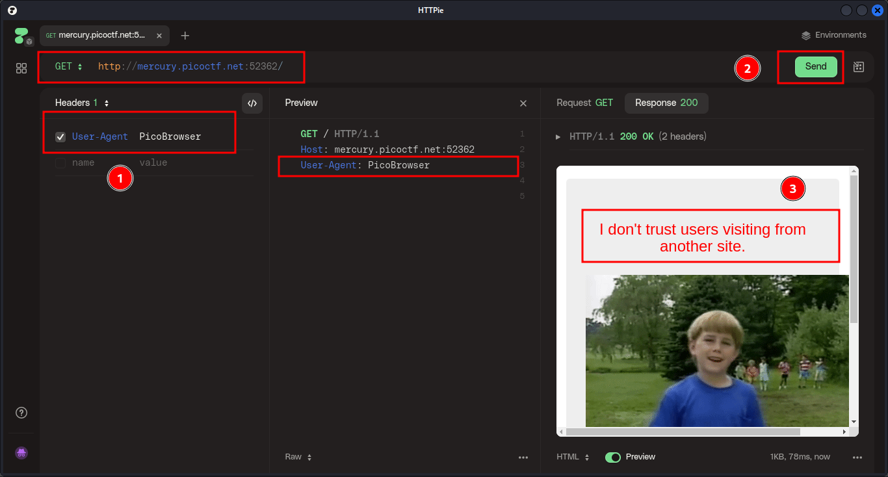
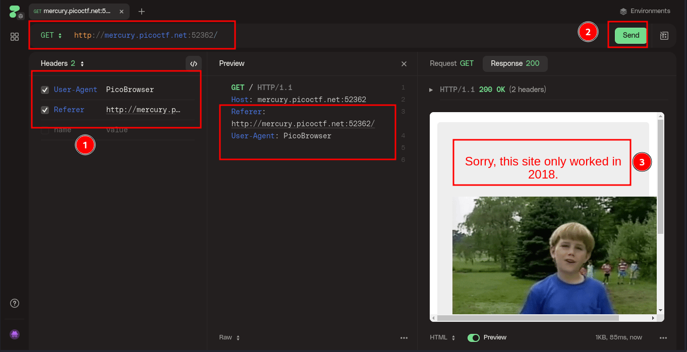
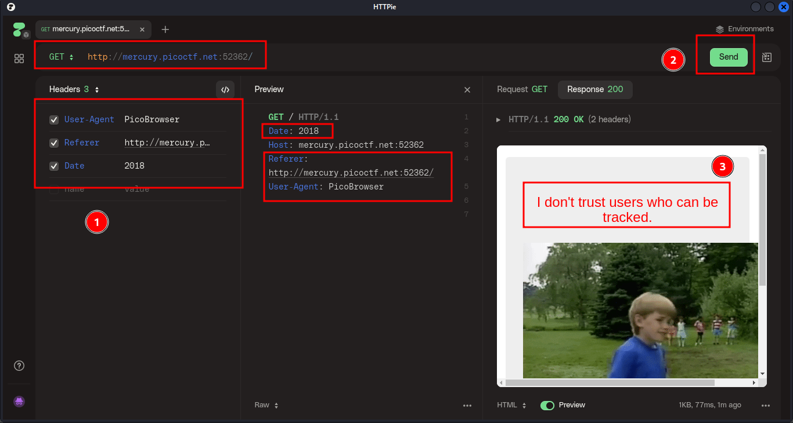
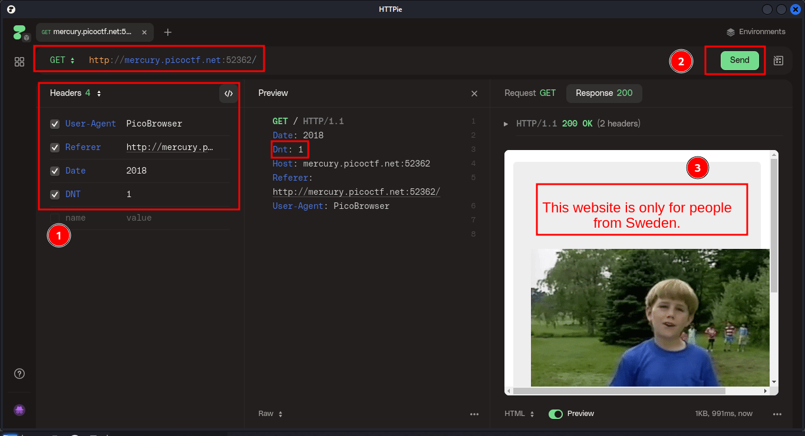
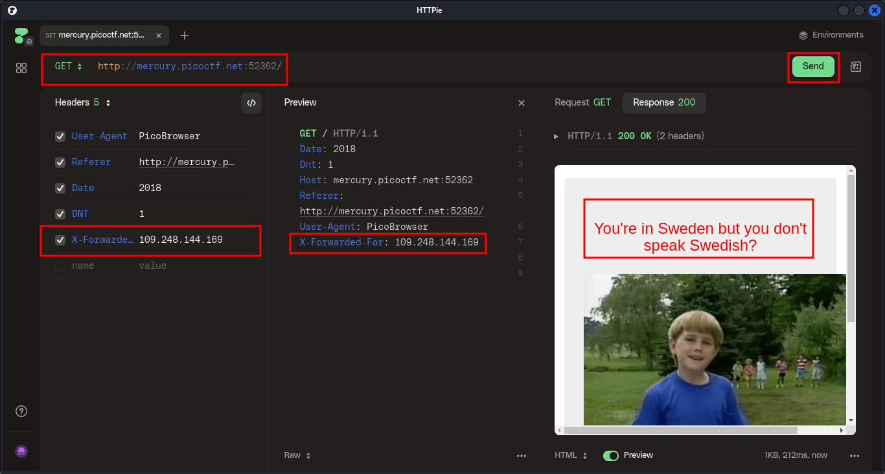
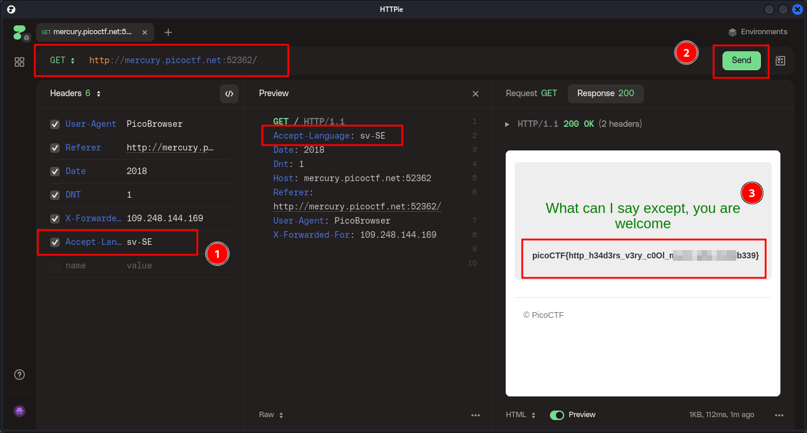
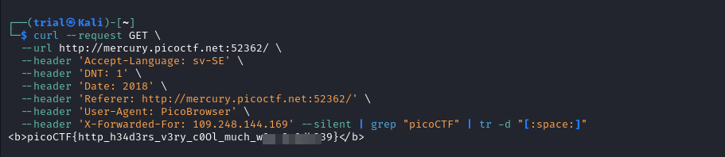

---
tags:
  - web-exploitation
points: 100 points
---

[<-- Web Exploitation Write-ups](../writeup-list.md)

# Who are you?
## Write-up

##### Concept Coverage :
This challenge introduces to the [HTTP Headers](https://developer.mozilla.org/en-US/docs/Web/HTTP/Headers)

##### Following are the steps for the challenge: 
1. We are given a URL in the challenge.At the timing of writing the URL was `http://mercury.picoctf.net:52362/` but it might change. 

2. Upon going to the website we notice that It only allows people to visit only if they are using `PicoBrowser`.

    

3. So in order to do this we need to update the `User-Agent` header to make server believe that we are using `PicoBrowser`. In order to achieve this I used a opensource tool called [HTTPie](https://httpie.io/) but you can also use tools like [Postman](https://www.postman.com/) or [BurpSuite](https://portswigger.net/burp) to achieve the same result. if you are interested in doing it in terminal you can leverage `curl` command in linux.

    

    

4. As you can see in above image now the message reads that `I dont trust Users visiting from another site`. Usually when you are visiting from a diffrent webite a HTTP header called `referer` is set. Since it doesnot accept the visitor from other site I set the `Referer` header to its own URL which in my case is `http://mercury.picoctf.net:52362/` . Upon sending that we get a new message.

    

5. Now the new message says `Sorry this site only worked in 2018`. In order to set the date we are visiting website we can set HTTP Header called `Date`. Upon setting `Date` to `2018` (Yes you can specify only an year) and sending the request we get a new message.

    

6. New message reads `I don't trust Users who can be tracked`. In order for a site to not track anything the HTTP header used for it is called `DNT` (Do Not Track). As per documentation we need to set its value to `1` to prevent tracking. (This is a Deprecated header)

    

7. As per the new request we notice that we get a new message saying `This website is only for people of sweden`. In order to identify the IP of the user a header called `X-Forwarded-For` is used if they are using a proxy. We can use it with a IP from Sweden for this. I searched only for an Sweden IP. in case I used `109.248.144.169`. As soon as we send the response we get a new message.

    

8. The new message says `You're in Sweden but you don't speak Swedish?` . In order to specify language we can use a HTTP header called `Accept-Language` and set its value to `sv-SE` (code for swedish). As soon as we update the header and send in a new request we get the message with the `flag`. (I have blurred out the flag in the image but it clearly visible in the output)

    

9. We can copy the flag and submit it to complete the challenge. If you are using `curl` the final command would look like this 

    ```bash
    curl --request GET \
      --url http://mercury.picoctf.net:52362/ \
      --header 'Accept-Language: sv-SE' \
      --header 'DNT: 1' \
      --header 'Date: 2018' \
      --header 'Referer: http://mercury.picoctf.net:52362/' \
      --header 'User-Agent: PicoBrowser' \
      --header 'X-Forwarded-For: 109.248.144.169' --silent | grep "picoCTF" | tr -d "[:space:]"
    ```

    