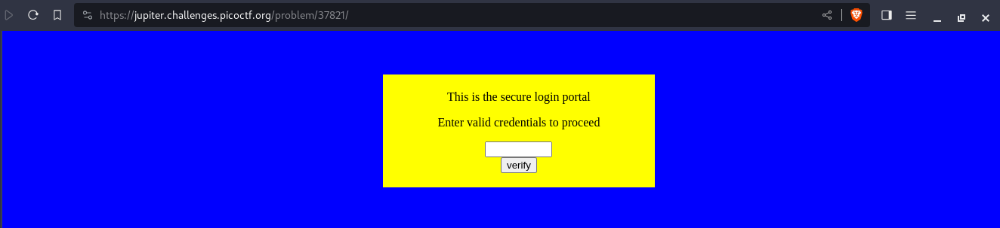

---
tags:
  - web-exploitation
points: 100 points
---

[<-- Web Exploitation Write-ups](../writeup-list.md)

# dont-use-client-side
## Write-up

##### Concept Coverage :
This challenge covers the concept of the client-side credential validation and how they can be vulnerable

##### Following are the steps for the challenge: 
1. We are given a link to the website with the challenge. At the time of writing the `URL` was `https://jupiter.challenges.picoctf.org/problem/37821/`. Upon navigating to the website we are presented with below webpage.

    

2. Upon entering random credential, we do notice that it has a password validation as it gives a popup of invalid password.

    

3. Upon taking a look at the `HTML` source in the we notice a `Javascript` function present to validate the entered password. From the function we can see that the function splits into diffrent set and compared. In order to get the correct password we just need to reaarange the string bits.

    

4. Upon rearranging we get the flag and we can submit to complete the challenge. 