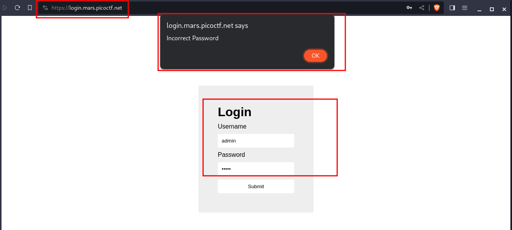
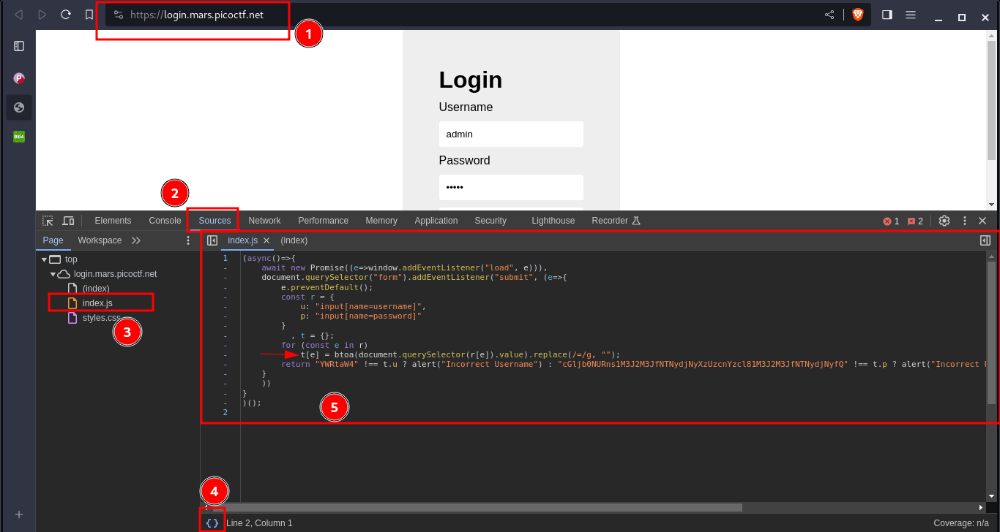
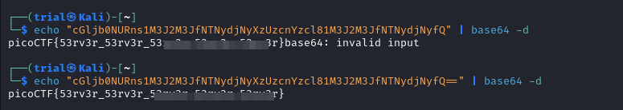

---
tags:
  - web-exploitation
points: 100 points
---

[<-- Web Exploitation Write-ups](../writeup-list.md)

# login
## Write-up

##### Concept Coverage :
This challenge covers the concept of JavaScript authentication on client-side

##### Following are the steps for the challenge: 
1. We are given URL as a part of the challenge. At the time of writing the URL was `https://login.mars.picoctf.net/` but this might change in the future.

2. Upon visiting the URL we get an authentication page. I entered username as `admin` and password as `admin` to see if we have any validation on the webpage. It gave me an alert pop with `Incorrect Password`. 

    

3. Since it was popup similar to JavaScript's `alert()` it lead to believe that authentication validation is done on JavaScript. So I decided to take a look at sources and found `index.js`. Looking at the JavaScript file I noticed that it take username and password input and converts them to base64 using `btoa()` function and then does a validation in the `return` line. 

    

4. Upon looking at the `return` value we see it does a nested [conditional ternary operation](https://developer.mozilla.org/en-US/docs/Web/JavaScript/Reference/Operators/Conditional_operator) in which first it checks if the base64 value of username is `YWRtaW4` or not. If the condition is `false` it returns `alert("Incorrect Username")` and if the condition is `true` it goes ahead and compares password to `cGljb0NURns1M3J2M3JfNTNydjNyXzUzcnYzcl81M3J2M3JfNTNydjNyfQ` in which it is `false` it returns `alert("Incorrect Password")` and if it is `true` it returns an `void alert("Correct Password! Your flag is ${atob(t.p)}"`. 

    ```javascript
    return "YWRtaW4" !== t.u ? alert("Incorrect Username") : "cGljb0NURns1M3J2M3JfNTNydjNyXzUzcnYzcl81M3J2M3JfNTNydjNyfQ" !== t.p ? alert("Incorrect Password") : void alert(`Correct Password! Your flag is ${atob(t.p)}.`)
    ```

5. As we notice the flag value is ASCII value of the correct password. we already have the password as base64 encode in the `return` statement. we can easily get the ASCII value from that using below bash code. Note you will notice in the output when I ran the command I got `base64: Invalid Input` that is because we have incorrect length of string for base64 but decoded was correct. The second output I added `==` padding to correct the length and output was clean.

    ```bash
    echo "<string-here>" | base64 -d
    ```

    