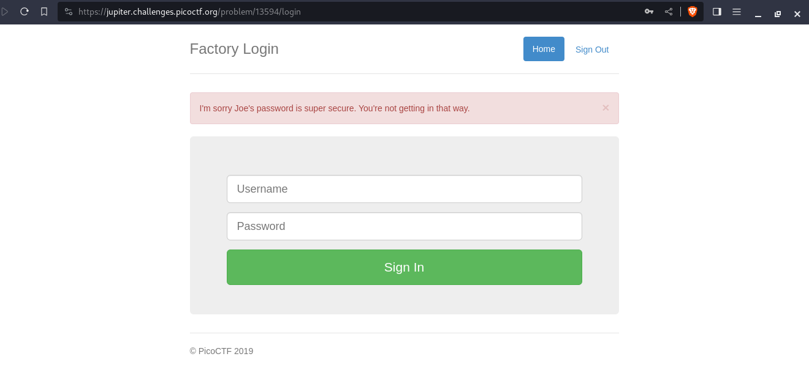

---
tags:
  - web-exploitation
points: 100 points
---

[<-- Web Exploitation Write-ups](../writeup-list.md)

# logon
## Write-up

##### Concept Coverage :
This challenge is introduction to cookie spoofing on a website

##### Following are the steps for the challenge: 
1. We are given a link to a website in which we have to login as a user to get the flag. At the time of writing the we have to login as `Joe` on `https://jupiter.challenges.picoctf.org/problem/13594/` but those can change in future. Website landing page looks like below : 

    

2. I tried to login as `Joe` and used `admin` as a password just to see if there is any sort of check in place and it looked like we have a validation for `Joe`.

    

3. Next I tried to login as user `admin` and password as `admin` while tring to see if uses any standard defaults and it logged me in but I am not able to see the flag. Upon playing around with it a bit it seems like it will log you in with any credentials except for when username is `Joe`.

    

3. So I decided to take a look if it has a cookie based validation to get the flag. upon checking the cookies after logging in I found that they have a `admin` cookie which is `False` for all other login.

    

4. I updated it to `True` and refreshed the page and it gave me the flag. we can submit that flag and complete the challenge.

    

    
