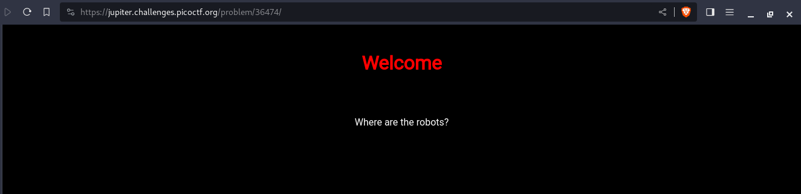
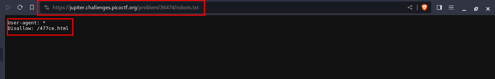
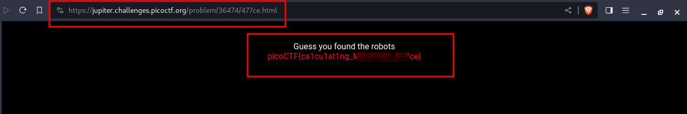

---
tags:
  - web-exploitation
points: 100 points
---

[<-- Web Exploitation Write-ups](../writeup-list.md)

# where are the robots
## Write-up

##### Concept Coverage :
This challenge is introduction to the concept of `robots.txt` on the websites

##### Following are the steps for the challenge: 
1. We are given a Web URL to conenct to with the challenge. As per the time of writing it was `https://jupiter.challenges.picoctf.org/problem/36474/` but this might change.

2. Upon visiting the website we get the website shown below. I also took at at the source files (HTML, CSS, JS, Cookies) but I didn't find anything odd. Looking at the challegne title `where are the robots` and also same text on the website lead me believe that we need to look for `robots.txt` file. It is mostly used to tell search engine crawlers which URLs the crawler can access on your site.

    

3. Upon navigating to `/robots.txt` we can see that `/477ce.html` is `disallowed` to be indexed by the search engines. 

    

4. Upon navigating at the `/477ce.html` we get thr flag. we can submit this flag and complete the challenge

    